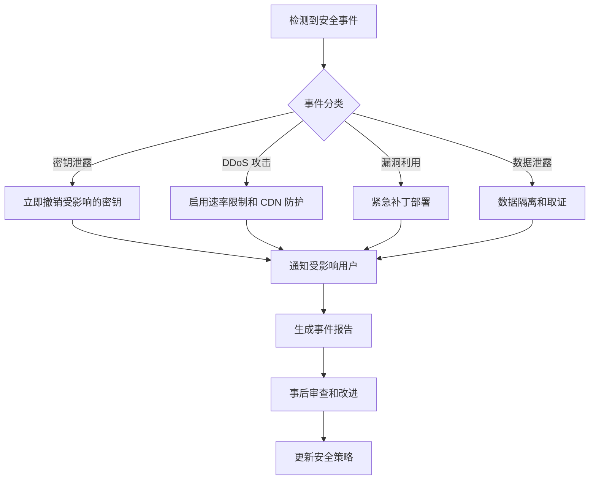

# Windows 虚拟局域网系统技术架构设计文档

**项目名称**: Windows Virtual LAN (WVLAN)  
**版本**: v1.0.0  
**作者**: Agent, 技术总监  
**审核**: Tommy, CEO  
**日期**: 2026-04-15  
**状态**: 架构设计阶段

---

## 目录

1. [系统架构图](#1-系统架构图)
2. [模块划分和接口定义](#2-模块划分和接口定义)
3. [WireGuard 驱动集成方案详解](#3-wireguard 驱动集成方案详解)
4. [NAT 穿透实现方案](#4-nat 穿透实现方案)
5. [控制服务器架构设计](#5-控制服务器架构设计)
6. [安全和加密方案](#6-安全和加密方案)
7. [性能指标和优化策略](#7-性能指标和优化策略)
8. [技术风险和应对方案](#8-技术风险和应对方案)
9. [编码规范和 CR 标准](#9-编码规范和 cr 标准)

---

## 1. 系统架构图

### 1.1 整体系统架构图 (ASCII)

```
┌─────────────────────────────────────────────────────────────────────────────┐
│                            CLIENT SIDE (Windows)                             │
├─────────────────────────────────────────────────────────────────────────────┤
│                                                                              │
│  ┌──────────────────────────────────────────────────────────────────────┐   │
│  │                        GUI LAYER (WPF - C#/XAML)                      │   │
│  ├──────────────────────────────────────────────────────────────────────┤   │
│  │  ┌──────────────┐  ┌──────────────┐  ┌──────────────┐               │   │
│  │  │  Dashboard   │  │ Connection Mgr│  │ Settings UI  │               │   │
│  │  └──────┬───────┘  └──────┬───────┘  └──────┬───────┘               │   │
│  │         │                  │                 │                       │   │
│  └─────────┼──────────────────┼─────────────────┼───────────────────────┘   │
│            │                  │                 │                           │
│            ▼                  ▼                 ▼                           │
│  ┌──────────────────────────────────────────────────────────────────────┐   │
│  │                    BUSINESS LOGIC LAYER (C# .NET 6)                   │   │
│  ├──────────────────────────────────────────────────────────────────────┤   │
│  │  ┌──────────────┐  ┌──────────────┐  ┌──────────────┐               │   │
│  │  │ Network Ctrl │  │ Config Mgr   │  │ Auth Service │               │   │
│  │  └──────┬───────┘  └──────┬───────┘  └──────┬───────┘               │   │
│  │         │                  │                 │                       │   │
│  └─────────┼──────────────────┼─────────────────┼───────────────────────┘   │
│            │                  │                 │                           │
│            ▼                  ▼                 ▼                           │
│  ┌──────────────────────────────────────────────────────────────────────┐   │
│  │                  NATIVE BRIDGE LAYER (C++/CLI Interop)                │   │
│  ├──────────────────────────────────────────────────────────────────────┤   │
│  │  ┌────────────────────────────────────────────────────────────────┐  │   │
│  │  │              NativeBridge.dll (C++ CLI Wrapper)                │  │   │
│  │  │  • WireGuard API Binding                                       │  │   │
│  │  │  • WinAPI Network Operations                                   │  │   │
│  │  │  • IPC Communication                                           │  │   │
│  │  └────────────────────────────────────────────────────────────────┘  │   │
│  └──────────────────────────────────────────────────────────────────────┘   │
│            │                                                                 │
│            ▼                                                                 │
│  ┌──────────────────────────────────────────────────────────────────────┐   │
│  │                     CORE LAYER (C++ Native)                           │   │
│  ├──────────────────────────────────────────────────────────────────────┤   │
│  │  ┌────────────────┐  ┌────────────────┐  ┌────────────────┐         │   │
│  │  │ WireGuard Core │  │ NAT Traversal  │  │ Local Database │         │   │
│  │  │ (wg-nt kernel) │  │ Module (STUN)  │  │ (SQLite)       │         │   │
│  │  └────────────────┘  └────────────────┘  └────────────────┘         │   │
│  └──────────────────────────────────────────────────────────────────────┘   │
│                                                                              │
│  ┌──────────────────────────────────────────────────────────────────────┐   │
│  │                         KERNEL LAYER                                  │   │
│  ├──────────────────────────────────────────────────────────────────────┤   │
│  │                    WireGuard-for-Windows Driver                       │   │
│  │                      (WGNT Kernel Module)                            │   │
│  └──────────────────────────────────────────────────────────────────────┘   │
│                                                                              │
└─────────────────────────────────────────────────────────────────────────────┘
                                      ▲
                                      │ HTTPS/gRPC
                                      │
┌─────────────────────────────────────┴───────────────────────────────────────┐
│                         CONTROL SERVER (Cloud)                               │
├─────────────────────────────────────────────────────────────────────────────┤
│                                                                              │
│  ┌──────────────────────────────────────────────────────────────────────┐   │
│  │                     API GATEWAY / LOAD BALANCER                       │   │
│  │                    (NGINX / Azure Load Balancer)                      │   │
│  └──────────────────────────────────────────────────────────────────────┘   │
│                                     │                                        │
│          ┌──────────────────────────┼──────────────────────────┐            │
│          │                          │                          │             │
│          ▼                          ▼                          ▼             │
│  ┌────────────────┐      ┌────────────────┐      ┌────────────────┐        │
│  │  Auth Service  │      │  Config Service│      │ Relay Service  │        │
│  │    (gRPC)      │      │    (RESTful)   │      │  (UDP/TCP)     │        │
│  └───────┬────────┘      └───────┬────────┘      └───────┬────────┘        │
│          │                       │                       │                 │
│          ▼                       ▼                       ▼                 │
│  ┌────────────────────────────────────────────────────────────────┐       │
│  │                      MESSAGE BROKER                            │       │
│  │                   (Redis Pub/Sub / RabbitMQ)                   │       │
│  └────────────────────────────────────────────────────────────────┘       │
│                              │                                            │
│                              ▼                                            │
│  ┌────────────────────────────────────────────────────────────────┐       │
│  │                        DATABASE LAYER                          │       │
│  ├────────────────────────────────────────────────────────────────┤       │
│  │  PostgreSQL (User Data)  +  Redis (Cache)  +  S3/Blob Storage  │       │
│  └────────────────────────────────────────────────────────────────┘       │
│                                                                              │
└─────────────────────────────────────────────────────────────────────────────┘
```

### 1.2 数据流架构图

```
┌─────────────┐     ┌─────────────┐     ┌─────────────┐     ┌─────────────┐
│   Client A  │────▶│ STUN Server │────▶│ Coord Serv  │◀────│   Client B  │
│ (Public IP) │     │ (Discover)  │     │  (Signaling)│     │ (Behind NAT)|
└──────┬──────┘     └─────────────┘     └──────┬──────┘     └──────┬──────┘
       │                                       │                   │
       │         ┌─────────────────────────────┴───────────────────┘       │
       │         │                                                         │
       │         ▼                                                         │
       │   ┌─────────────┐                                                │
       │   │ P2P Direct  │◀────────── P2P Connection Established ─────────┤
       │   │  (If Possible)                                              │
       │   └─────────────┘                                                │
       │         │                                                         │
       │         │ Not Possible?                                          │
       │         ▼                                                         │
       │   ┌─────────────┐     ┌─────────────┐                           │
       │   │   TURN/Relay│◀───▶│  Relay Svc  │                           │
       │   │   (Fallback)│     │   (Server)  │                           │
       │   └─────────────┘     └─────────────┘                           │
       │                                                                 │
       └──────────────── WireGuard Encrypted Tunnel ─────────────────────┘
```

---

## 2. 模块划分和接口定义

### 2.1 客户端模块划分

#### 2.1.1 GUI Layer (WPF - C#)

**模块职责**: 用户界面展示、用户交互处理

**核心类**:
```csharp
// Main Window Controller
public class MainWindowViewModel : INotifyPropertyChanged
{
    public ObservableCollection<NetworkPeer> Peers { get; set; }
    public bool IsConnected { get; set; }
    public double UploadSpeed { get; set; }
    public double DownloadSpeed { get; set; }
    
    public ICommand ConnectCommand { get; set; }
    public ICommand DisconnectCommand { get; set; }
    public ICommand AddPeerCommand { get; set; }
    public ICommand RemovePeerCommand { get; set; }
}

// Connection Manager UI
public class ConnectionManagerControl : UserControl
{
    // Displays peer list, connection status, latency info
}

// Settings Panel
public class SettingsPanelControl : UserControl
{
    // User preferences, network settings, security options
}
```

**UI 接口**:
- `ConnectAsync()`: 连接到虚拟网络
- `DisconnectAsync()`: 断开连接
- `AddPeer(PeerConfig)`: 添加对等节点
- `RemovePeer(Guid peerId)`: 移除对等节点
- `GetConnectionStatus()`: 获取当前连接状态

#### 2.1.2 Business Logic Layer (C# .NET 6)

**模块职责**: 业务逻辑处理、状态管理、协调各层

**核心服务接口**:

```csharp
// 网络连接控制器
public interface INetworkController
{
    Task<ConnectionResult> InitializeAsync(NetworkConfig config);
    Task<bool> StartAsync();
    Task<bool> StopAsync();
    Task<PeerStatus> GetPeerStatusAsync(Guid peerId);
    Task<List<PeerInfo>> GetAllPeersAsync();
    event EventHandler<ConnectionEventArgs> ConnectionStateChanged;
    event EventHandler<PeerEvent> PeerEventOccurred;
}

// 配置管理器
public interface IConfigManager
{
    Task<UserConfig> LoadConfigAsync(string userId);
    Task<bool> SaveConfigAsync(UserConfig config);
    Task<NetworkConfig> GetCurrentNetworkConfigAsync();
    Task UpdateNetworkConfigAsync(NetworkConfig config);
}

// 认证服务
public interface IAuthService
{
    Task<AuthResult> LoginAsync(string username, string password);
    Task<AuthResult> RegisterAsync(RegisterRequest request);
    Task<TokenPair> RefreshTokenAsync(string refreshToken);
    Task<bool> ValidateTokenAsync(string token);
    void Logout();
}

// 密钥管理服务
public interface IKeyManager
{
    Task<KeyPair> GenerateKeyPairAsync();
    Task<bool> StorePrivateKeyAsync(string keyId, byte[] privateKey);
    Task<byte[]> GetPrivateKeyAsync(string keyId);
    Task<bool> ExportPublicKeyAsync(string keyId, out byte[] publicKey);
    Task RotateKeyAsync(string keyId);
}
```

#### 2.1.3 Native Bridge Layer (C++/CLI)

**模块职责**: 托管代码与非托管代码的互操作桥接

**关键实现**:
```cpp
// NativeBridge.h - C++/CLI Wrapper
#pragma once

using namespace System;
using namespace System::Runtime::InteropServices;

namespace WVLAN::NativeBridge {
    
    public ref class WireGuardClient
    {
    public:
        WireGuardClient();
        ~WireGuardClient();
        
        // 初始化 WireGuard 适配器
        int InitializeAdapter(String^ adapterName, String^ privateKey, 
                              String^ listenPort);
        
        // 添加对等节点
        int AddPeer(String^ publicKey, String^ endpoint, String^ allowedIPs);
        
        // 移除对等节点
        int RemovePeer(String^ publicKey);
        
        // 设置监听端口
        int SetListenPort(int port);
        
        // 获取统计信息
        IntPtr GetStatistics();
        
        // 关闭适配器
        int ShutdownAdapter();
        
    private:
        WgDeviceHandle* _deviceHandle;
    };
    
    public ref class NetworkOperations
    {
    public:
        // 获取本地 IP 地址
        array<String^>^ GetLocalIPAddresses();
        
        // 检测网络类型
        NetworkType DetectNetworkType();
        
        // 设置路由表
        int AddRoute(String^ destination, String^ gateway, int metric);
        
        // 删除路由表项
        int DeleteRoute(String^ destination);
        
        // 检查管理员权限
        bool IsRunAsAdmin();
    };
}
```

#### 2.1.4 Core Layer (C++ Native)

**模块职责**: 核心功能实现、系统级操作

**模块结构**:
```
core/
├── wireguard/
│   ├── wg_nt_control.cpp      # WireGuard NT 驱动控制
│   ├── wg_interface.cpp       # 网络接口管理
│   └── wg_statistics.cpp      # 流量统计
├── nat_traversal/
│   ├── stun_client.cpp        # STUN 客户端实现
│   ├── turn_client.cpp        # TURN 客户端实现
│   ├── relay_handler.cpp      # 中继处理
│   └── connectivity_checker.cpp # 连通性检测
├── crypto/
│   ├── key_exchange.cpp       # 密钥交换
│   ├── encryption.cpp         # 加密解密
│   └── certificate_manager.cpp # 证书管理
├── database/
│   ├── sqlite_wrapper.cpp     # SQLite 封装
│   └── config_storage.cpp     # 配置存储
└── logging/
    └── logger.cpp             # 日志系统
```

**核心 API 定义**:
```cpp
// wireguard/wg_api.h
#ifndef WG_API_H
#define WG_API_H

#ifdef __cplusplus
extern "C" {
#endif

typedef void* WG_DEVICE_HANDLE;
typedef void (*WG_LOG_CALLBACK)(int level, const char* message);
typedef void (*WG_STATISTICS_CALLBACK)(const char* peer_public_key, 
                                       uint64_t tx_bytes, uint64_t rx_bytes);

// 初始化
WG_DEVICE_HANDLE wg_create_device(const wchar_t* device_name);
void wg_set_logger(WG_LOG_CALLBACK callback);

// 配置
int wg_configure_device(WG_DEVICE_HANDLE handle, 
                        const char* private_key,
                        uint16_t listen_port);
                        
int wg_add_peer(WG_DEVICE_HANDLE handle,
                const char* public_key,
                const char* endpoint,
                const char* allowed_ips,
                int persistent_keepalive);

int wg_remove_peer(WG_DEVICE_HANDLE handle, const char* public_key);

// 状态
int wg_up(WG_DEVICE_HANDLE handle);
int wg_down(WG_DEVICE_HANDLE handle);
void wg_get_statistics(WG_DEVICE_HANDLE handle, 
                       WG_STATISTICS_CALLBACK callback);

// 资源释放
void wg_close_device(WG_DEVICE_HANDLE handle);

#ifdef __cplusplus
}
#endif

#endif // WG_API_H
```

### 2.2 服务端模块划分

#### 2.2.1 API Gateway

**职责**: 请求路由、负载均衡、限流、认证前置

**技术选型**: NGINX + Lua 或 Azure API Management

**接口定义**:
```yaml
# OpenAPI 规范片段
openapi: 3.0.0
info:
  title: WVLAN Control API
  version: 1.0.0

paths:
  /api/v1/auth/login:
    post:
      summary: 用户登录
      requestBody:
        content:
          application/json:
            schema:
              $ref: '#/components/schemas/LoginRequest'
      responses:
        '200':
          description: 登录成功
          content:
            application/json:
              schema:
                $ref: '#/components/schemas/AuthResponse'

  /api/v1/users/{userId}/peers:
    get:
      summary: 获取用户的对等节点列表
      parameters:
        - name: userId
          in: path
          required: true
          schema:
            type: string
            format: uuid
      responses:
        '200':
          description: 对等节点列表
          
  /api/v1/relays:
    get:
      summary: 获取可用中继服务器列表
      responses:
        '200':
          description: 中继服务器列表
```

#### 2.2.2 Authentication Service (gRPC)

**Protobuf 定义**:
```protobuf
syntax = "proto3";

package wvlan.auth;

service AuthService {
  rpc Login(LoginRequest) returns (LoginResponse);
  rpc Register(RegisterRequest) returns (RegisterResponse);
  rpc RefreshToken(TokenRefreshRequest) returns (TokenRefreshResponse);
  rpc ValidateToken(TokenValidateRequest) returns (TokenValidateResponse);
  rpc RevokeToken(TokenRevokeRequest) returns (TokenRevokeResponse);
}

message LoginRequest {
  string username = 1;
  string password = 2;
}

message LoginResponse {
  string access_token = 1;
  string refresh_token = 2;
  int64 expires_in = 3;
  UserContext user = 4;
}

message UserContext {
  string user_id = 1;
  string email = 2;
  repeated string roles = 3;
  map<string, string> metadata = 4;
}

message TokenRefreshRequest {
  string refresh_token = 1;
}

message TokenRefreshResponse {
  string access_token = 1;
  int64 expires_in = 2;
}
```

#### 2.2.3 Configuration Service (RESTful)

**核心 API**:
```csharp
// Controllers/ConfigurationController.cs
[ApiController]
[Route("api/v1/configuration")]
public class ConfigurationController : ControllerBase
{
    private readonly IConfigurationService _configService;
    
    [HttpPost("{networkId}/peers")]
    public async Task<IActionResult> AddPeer(
        Guid networkId, 
        [FromBody] PeerConfigDto peerConfig)
    {
        var result = await _configService.AddPeerAsync(networkId, peerConfig);
        return Ok(result);
    }
    
    [HttpGet("{networkId}/configuration")]
    public async Task<IActionResult> GetNetworkConfig(Guid networkId)
    {
        var config = await _configService.GetNetworkConfigAsync(networkId);
        return Ok(config);
    }
    
    [WebSocketRoute("ws/{networkId}/sync")]
    public async Task SyncConfiguration(Guid networkId)
    {
        // WebSocket 实时同步配置变更
    }
}
```

#### 2.2.4 Relay Service

**UDP Relay Implementation**:
```rust
// 使用 Tokio 异步框架
use tokio::net::UdpSocket;
use std::collections::HashMap;

pub struct RelayService {
    sockets: HashMap<String, Arc<UdpSocket>>,
    connections: Arc<RwLock<HashMap<(u128, u128), RelaySession>>>,
}

impl RelayService {
    pub async fn handle_relay(&self, 
                              source_pubkey: &str,
                              dest_pubkey: &str,
                              data: &[u8]) -> Result<Vec<u8>, RelayError> {
        let session_key = self.get_session_key(source_pubkey, dest_pubkey);
        
        // 查找或创建中继会话
        let session = self.get_or_create_session(session_key).await?;
        
        // 转发数据包
        session.forward(data).await
    }
}
```

---

## 3. WireGuard 驱动集成方案详解

### 3.1 WireGuard-for-Windows 选择理由

**官方推荐方案**: WireGuard-for-C (https://git.zx2c4.com/WireGuard-for-C/)

**优势**:
1. **官方维护**: WireGuard 官方项目，持续更新
2. **内核模式驱动**: 使用 Windows 原生 WFP (Windows Filtering Platform)
3. **高性能**: 基于 ChaCha20-Poly1305 加密，性能优异
4. **成熟稳定**: 已在生产环境广泛使用
5. **MIT 许可**: 商业友好许可证

**替代方案对比**:
| 方案 | 性能 | 稳定性 | 维护状况 | 推荐度 |
|------|------|--------|----------|--------|
| WireGuard-for-C | ⭐⭐⭐⭐⭐ | ⭐⭐⭐⭐⭐ | ✅ Active | ★★★★★ |
| OpenVPN | ⭐⭐⭐ | ⭐⭐⭐⭐ | ✅ Active | ★★★☆☆ |
| SoftEther | ⭐⭐⭐⭐ | ⭐⭐⭐ | ⚠️ Slow | ★★☆☆☆ |
| Custom TAP | ⭐⭐ | ⭐⭐⭐ | ❌ Deprecated | ★☆☆☆☆ |

### 3.2 驱动部署方案

**安装包结构设计**:
```
WVLAN-Installer/
├── drivers/
│   ├── wireguard.sys           # 内核驱动
│   ├── wireguard.inf           # 驱动安装信息
│   └── wvdll.dll               # 用户态 DLL
├── application/
│   ├── WVLAN.Client.exe        # 主程序
│   ├── WVLAN.NativeBridge.dll  # C++/CLI 桥接层
│   ├── WireGuard.CSharp.dll    # WireGuard 绑定库
│   └── configuration/
│       └── appsettings.json
├── services/
│   └── WVLAN.Service.exe       # 后台服务 (可选)
└── installer.wxs               # WiX 安装脚本
```

**驱动签名要求**:
```powershell
# 开发者需要 EV 代码签名证书
# 步骤 1: 生成测试证书 (开发阶段)
New-SelfSignedCertificate `
  -Type CodeSigning `
  -Subject "CN=WVLAN Developer" `
  -KeyUsage DigitalSignature `
  -KeyLength 2048 `
  -CertStoreLocation "Cert:\CurrentUser\My"

# 步骤 2: 使用 DigiCert/Sectigo 购买 EV 证书
# 步骤 3: 时间戳签名
signtool sign /tr http://timestamp.digicert.com /td sha256 /fd sha256 driver.sys
```

**Windows 驱动程序部署流程**:
```csharp
// 驱动安装管理器
public class DriverInstaller
{
    public async Task<bool> InstallDriverAsync(string driverPath)
    {
        // 检查管理员权限
        if (!IsAdministrator())
            throw new UnauthorizedAccessException("需要管理员权限");
            
        // 停止现有服务
        await StopServiceAsync("WVLANWireGuard");
        
        // 使用 sc.exe 安装驱动
        var process = Process.Start(new ProcessStartInfo
        {
            FileName = "sc.exe",
            Arguments = $"create WVLANWireGuard type= kernel binPath= \"{driverPath}\"",
            RedirectStandardOutput = true,
            UseShellExecute = false
        });
        
        await process.WaitForExitAsync();
        
        // 启动服务
        process = Process.Start(new ProcessStartInfo
        {
            FileName = "sc.exe",
            Arguments = "start WVLANWireGuard",
            RedirectStandardOutput = true,
            UseShellExecute = false
        });
        
        return await process.WaitForExitAsync() == 0;
    }
}
```

### 3.3 WireGuard 配置管理

**配置文件格式**:
```ini
# Client Configuration Template
[Interface]
PrivateKey = <CLIENT_PRIVATE_KEY>
Address = 10.0.0.2/32
DNS = 10.0.0.1
MTU = 1420

# Peer 1 - Primary Node
[Peer]
PublicKey = <SERVER_PUBLIC_KEY>
Endpoint = relay1.wvlan.io:51820
AllowedIPs = 10.0.0.0/24
PersistentKeepalive = 25

# Peer 2 - Backup Node  
[Peer]
PublicKey = <BACKUP_SERVER_PUBLIC_KEY>
Endpoint = relay2.wvlan.io:51820
AllowedIPs = 10.0.0.0/24
PersistentKeepalive = 25
```

**动态配置 API**:
```csharp
public class WireGuardConfig
{
    public string PrivateKey { get; set; }
    public List<IPAddress> Addresses { get; set; }
    public uint ListenPort { get; set; }
    public int MTU { get; set; } = 1420;
    
    public List<PeerConfig> Peers { get; set; }
}

public class PeerConfig
{
    public string PublicKey { get; set; }
    public IPEndPoint Endpoint { get; set; }
    public List<IPAddressRange> AllowedIPs { get; set; }
    public int PersistentKeepalive { get; set; } = 0;
}

public interface IWireGuardManager
{
    Task InitializeAsync(WireGuardConfig config);
    Task ApplyConfigAsync(WireGuardConfig config);
    Task<PeerStats> GetPeerStatsAsync(string publicKey);
    Task ResetStatsAsync();
}
```

### 3.4 接口状态监控

```csharp
// 实现接口状态回调
public class WireGuardMonitor
{
    private readonly Timer _statsTimer;
    
    public WireGuardMonitor(IWireGuardManager manager)
    {
        _statsTimer = new Timer(async _ =>
        {
            var peers = await manager.GetAllPeersAsync();
            foreach (var peer in peers)
            {
                var stats = await manager.GetPeerStatsAsync(peer.PublicKey);
                OnPeerStatsUpdated(new PeerStatsEventArgs
                {
                    Peer = peer,
                    TxBytes = stats.TxBytes,
                    RxBytes = stats.RxBytes,
                    LastHandshake = stats.LastHandshake,
                    RTT = stats.RTT
                });
            }
        }, null, TimeSpan.Zero, TimeSpan.FromSeconds(2));
    }
}
```

---

## 4. NAT 穿透实现方案

### 4.1 NAT 穿透策略优先级

```
优先级别 1: P2P 直接连接 (UDP Hole Punching)
    ↓ 失败
优先级别 2: UDP 通过TURN中继
    ↓ 失败  
优先级别 3: TCP  fallback 通过 TURN-TCP
    ↓ 失败
优先级别 4: HTTP/HTTPS WebRTC DataChannel 中继
```

### 4.2 STUN 服务器发现协议

**客户端 STUN 探测流程**:
```
┌─────────┐     STUN Binding Request      ┌─────────────┐
│ Client  │──────────────────────────────▶│ STUN Server │
│         │                               └─────────────┘
│         │◀──────────────────────────────
└─────────┘       STUN Binding Response
        
响应包含:
- MAPPED-ADDRESS: 客户端公网地址
- XOR-MAPPED-ADDR: 备用映射地址
- CHANGE-REQUEST: 用于对称 NAT 检测
```

**STUN 客户端实现**:
```cpp
// nat_traversal/stun_client.h
class StunClient {
public:
    struct PublicAddress {
        std::string ip_address;
        uint16_t port;
        AddressType address_type; // HOST, SRFLX, PRFLX, RELAY
    };
    
    // 探测公共地址
    static std::future<PublicAddress> discover_public_address(
        const std::string& stun_server,
        uint16_t stun_port);
    
    // 检测 NAT 类型
    static NatType detect_nat_type(
        const std::string& stun_server,
        uint16_t stun_port);
};

enum class NatType {
    OPEN_INTERNET,          // 无 NAT
    FULL_CONE,              // 全锥型
    RESTRICTED_CONE,        // 限制锥型
    PORT_RESTRICTED_CONE,   // 端口限制锥型
    SYMMETRIC,              // 对称型 (最难穿透)
    SYMMETRIC_UDP_FIREWALL  // UDP 防火墙
};
```

### 4.3 ICE (Interactive Connectivity Establishment)

**ICE 候选收集**:
```rust
// 候选人收集器
pub struct IceAgent {
    local_candidates: Vec<Candidate>,
    remote_candidates: Vec<Candidate>,
    nominations: Vec<Nomination>,
}

impl IceAgent {
    pub async fn gather_candidates(
        &mut self,
        stun_servers: &[StunServer],
        turn_servers: &[TurnServer],
    ) -> Result<()> {
        // 1. Host candidate (本地接口)
        for iface in network_interfaces() {
            self.local_candidates.push(Candidate::Host {
                address: iface.ip,
                port: self.local_port(),
                priority: calculate_priority(126, 1, TYPE_HOST),
            });
        }
        
        // 2. Srflx candidate (通过 STUN)
        for server in stun_servers {
            let public_addr = stun_discover(server).await?;
            self.local_candidates.push(Candidate::Srflx {
                address: public_addr.ip,
                port: public_addr.port,
                base: self.local_address(),
                priority: calculate_priority(116, 1, TYPE_SRFLX),
            });
        }
        
        // 3. Relay candidate (通过 TURN)
        for server in turn_servers {
            let relay_addr = turn_allocate(server).await?;
            self.local_candidates.push(Candidate::Relay {
                address: relay_addr.ip,
                port: relay_addr.port,
                base: self.local_address(),
                priority: calculate_priority(0, 1, TYPE_RELAY),
            });
        }
        
        Ok(())
    }
}
```

### 4.4 TURN 服务器集成方案

**客户端 TURN 连接**:
```python
# Python pseudocode for TURN client logic
import aioreturn

class TurnClient:
    def __init__(self, servers: List[TurnServer]):
        self.servers = servers
        self.allocation = None
        
    async def connect(self) -> RelayedAddress:
        for server in sorted(self.servers, key=lambda s: s.priority):
            try:
                # Try UDP first
                self.allocation = await aioreturn.allocate(
                    server.address,
                    username=self.username,
                    password=self.password,
                    transport='udp'
                )
                return self.allocation.relayed_address
            except Exception as e:
                logger.warning(f"UDP TURN failed: {e}")
                
                # Fallback to TCP
                try:
                    self.allocation = await aioreturn.allocate(
                        server.address,
                        username=self.username,
                        password=self.password,
                        transport='tcp'
                    )
                    return self.allocation.relayed_address
                except Exception as tcp_e:
                    logger.error(f"TCP TURN failed: {tcp_e}")
                    
        raise ConnectionError("All TURN servers unavailable")
```

**TURN 服务器部署建议**:
```yaml
# docker-compose.yml for coturn
version: '3.8'
services:
  turn-server:
    image: coturn/coturn
    ports:
      - "3478:3478"   # STUN/TURN UDP
      - "3478:3478/tcp"
      - "5349:5349"   # STUN/TURN TLS
      - "49152-65535:49152-65535/udp"  # Relay port range
      - "49152-65535:49152-65535/tcp"
    environment:
      - LISTENING-PORT=3478
      - MIN-PORT=49152
      - MAX-PORT=65535
      - REALM=wvlan.io
      - AUTHENTICATION=yes
    volumes:
      - ./turnserver.conf:/etc/turnserver.conf
    restart: unless-stopped
```

### 4.5 连接质量评估与切换

```csharp
public class ConnectionQualityEvaluator
{
    public enum QualityLevel { Excellent, Good, Fair, Poor, Unusable }
    
    public record ConnectionMetrics(
        double LatencyMs,
        double PacketLossRate,
        double JitterMs,
        long BandwidthKbps
    );
    
    public QualityLevel EvaluateQuality(ConnectionMetrics metrics)
    {
        if (metrics.LatencyMs < 50 && metrics.PacketLossRate < 0.01 &&
            metrics.JitterMs < 10 && metrics.BandwidthKbps > 1000)
            return QualityLevel.Excellent;
            
        if (metrics.LatencyMs < 100 && metrics.PacketLossRate < 0.05 &&
            metrics.JitterMs < 20 && metrics.BandwidthKbps > 500)
            return QualityLevel.Good;
            
        if (metrics.LatencyMs < 200 && metrics.PacketLossRate < 0.1 &&
            metrics.JitterMs < 50 && metrics.BandwidthKbps > 100)
            return QualityLevel.Fair;
            
        if (metrics.LatencyMs < 500 && metrics.PacketLossRate < 0.2)
            return QualityLevel.Poor;
            
        return QualityLevel.Unusable;
    }
    
    // 自动切换策略
    public async Task HandleQualityDegradation(
        CurrentConnection current,
        QualityLevel currentQuality,
        List<AvailablePath> alternatives)
    {
        if (currentQuality == QualityLevel.Poor || 
            currentQuality == QualityLevel.Unusable)
        {
            var bestAlternative = alternatives
                .OrderByDescending(a => a.QualityScore)
                .FirstOrDefault();
                
            if (bestAlternative != null && 
                bestAlternative.QualityScore > current.QualityScore * 1.5)
            {
                await SwitchConnection(current, bestAlternative);
            }
        }
    }
}
```

---

## 5. 控制服务器架构设计

### 5.1 云基础设施架构

```
┌─────────────────────────────────────────────────────────────────────────────┐
│                           AZURE / AWS CLOUD                                 │
├─────────────────────────────────────────────────────────────────────────────┤
│                                                                             │
│  ┌─────────────────────────────────────────────────────────────────────┐   │
│  │                        GLOBAL LOAD BALANCER                          │   │
│  │              (Azure Front Door / AWS Global Accelerator)            │   │
│  └────────────────────────────────┬────────────────────────────────────┘   │
│                                   │                                         │
│         ┌─────────────────────────┼─────────────────────────┐              │
│         │                         │                         │               │
│         ▼                         ▼                         ▼               │
│  ┌──────────────┐         ┌──────────────┐         ┌──────────────┐       │
│  │  US-East     │         │  EU-West     │         │  Asia-Pacific│       │
│  │  (Virginia)  │         │  (Ireland)   │         │  (Singapore) │       │
│  └──────┬───────┘         └──────┬───────┘         └──────┬───────┘       │
│         │                        │                        │               │
│         │                        │                        │               │
│         ▼                        ▼                        ▼               │
│  ┌────────────────────────────────────────────────────────────────┐      │
│  │                     REGIONAL SERVICES                            │      │
│  ├────────────────────────────────────────────────────────────────┤      │
│  │                                                                │      │
│  │  ┌──────────┐  ┌──────────┐  ┌──────────┐  ┌──────────┐       │      │
│  │  │  API GW  │  │  Auth    │  │ Config   │  │  Relay   │       │      │
│  │  │  Service │  │  Service │  │ Service  │  │  Service │       │      │
│  │  └────┬─────┘  └────┬─────┘  └────┬─────┘  └────┬─────┘       │      │
│  │       │             │             │             │              │      │
│  │       └─────────────┴──────┬──────┴─────────────┘              │      │
│  │                            │                                    │      │
│  │                            ▼                                    │      │
│  │  ┌─────────────────────────────────────────────────────────┐   │      │
│  │  │                   DATA LAYER                             │   │      │
│  │  ├─────────────────────────────────────────────────────────┤   │      │
│  │  │  PostgreSQL (Primary)  +  Read Replicas  +  Redis Cache │   │      │
│  │  │  Azure SQL / AWS RDS  +  ElastiCache / MemoryDB         │   │      │
│  │  └─────────────────────────────────────────────────────────┘   │      │
│  │                                                                │      │
│  └────────────────────────────────────────────────────────────────┘      │
│                                                                             │
│  ┌─────────────────────────────────────────────────────────────────────┐   │
│  │                      GLOBAL SERVICES                                 │   │
│  ├─────────────────────────────────────────────────────────────────────┤   │
│  │  ┌──────────────┐  ┌──────────────┐  ┌──────────────┐              │   │
│  │  │   CDN        │  │ Object Store │  │   Monitoring │              │   │
│  │  │  (Edge)      │  │   (S3/Blob)  │  │ (App Insights)              │   │
│  │  └──────────────┘  └──────────────┘  └──────────────┘              │   │
│  └─────────────────────────────────────────────────────────────────────┘   │
│                                                                             │
└─────────────────────────────────────────────────────────────────────────────┘
```

### 5.2 微服务详细设计

#### 5.2.1 认证服务 (Auth Service)

**部署配置**:
```yaml
# docker-compose.auth.yaml
version: '3.8'
services:
  auth-service:
    build: ./services/auth
    image: wvlan/auth-service:latest
    ports:
      - "5001:5001"  # gRPC
    environment:
      - ASPNETCORE_ENVIRONMENT=Production
      - DB_CONNECTION_STRING=${POSTGRES_CONN}
      - REDIS_CONNECTION_STRING=${REDIS_CONN}
      - JWT_SECRET_KEY=${JWT_SECRET}
      - TOKEN_EXPIRY_MINUTES=30
      - REFRESH_TOKEN_DAYS=30
    depends_on:
      - postgres
      - redis
    deploy:
      replicas: 3
      resources:
        limits:
          cpus: '1'
          memory: 512M
```

**核心代码结构**:
```csharp
// Services/AuthService.cs
public class AuthService : AuthServiceBase
{
    private readonly IUserRepository _userRepository;
    private readonly ITokenService _tokenService;
    private readonly ILogger<AuthService> _logger;
    
    public override async Task<LoginResponse> Login(
        LoginRequest request, 
        ServerCallContext context)
    {
        var user = await _userRepository.GetUserByUsernameAsync(request.Username);
        
        if (user == null || !VerifyPassword(request.Password, user.PasswordHash))
        {
            throw new RpcException(new Status(StatusCode.Unauthenticated, 
                "Invalid credentials"));
        }
        
        // 检查账户状态
        if (!user.IsActive)
        {
            throw new RpcException(new Status(StatusCode.PermissionDenied,
                "Account is disabled"));
        }
        
        // 生成令牌
        var accessToken = _tokenService.GenerateAccessToken(user);
        var refreshToken = _tokenService.GenerateRefreshToken(user);
        
        // 存储刷新令牌
        await _userRepository.StoreRefreshTokenAsync(user.Id, refreshToken);
        
        // 记录登录事件
        await _userRepository.LogLoginEventAsync(user.Id, context.Peer);
        
        return new LoginResponse
        {
            AccessToken = accessToken,
            RefreshToken = refreshToken,
            ExpiresIn = 1800, // 30 minutes
            User = new UserContext
            {
                UserId = user.Id.ToString(),
                Email = user.Email,
                Roles = { user.Roles.ToArray() },
                Metadata = { user.Metadata }
            }
        };
    }
}
```

#### 5.2.2 配置同步服务

**WebSocket 实时同步**:
```csharp
// Hubs/ConfigurationSyncHub.cs
public class ConfigurationSyncHub : Hub
{
    private readonly IConfigurationService _configService;
    private readonly ILogger<ConfigurationSyncHub> _logger;
    
    public async Task JoinNetwork(Guid networkId)
    {
        var userId = Context.UserIdentifier;
        
        // 验证用户是否属于该网络
        var isMember = await _configService.IsNetworkMemberAsync(userId, networkId);
        if (!isMember)
        {
            throw new HubException("User not member of this network");
        }
        
        await Groups.AddToGroupAsync(Context.ConnectionId, $"network-{networkId}");
        
        _logger.LogInformation($"User {userId} joined network {networkId}");
    }
    
    public async Task PushConfiguration(Guid networkId, NetworkConfigDto config)
    {
        var userId = Context.UserIdentifier;
        
        // 验证修改权限
        var canModify = await _configService.CanModifyNetworkAsync(userId, networkId);
        if (!canModify)
        {
            throw new HubException("No permission to modify network config");
        }
        
        // 保存配置
        await _configService.UpdateNetworkConfigAsync(networkId, config);
        
        // 广播给所有在线客户端
        await Clients.Group($"network-{networkId}")
            .SendAsync("ConfigurationUpdated", new { 
                NetworkId = networkId, 
                Config = config,
                UpdatedBy = userId,
                Timestamp = DateTime.UtcNow 
            });
    }
    
    public async Task<NetworkConfigDto> GetLatestConfig(Guid networkId)
    {
        return await _configService.GetNetworkConfigAsync(networkId);
    }
}
```

**消息队列集成**:
```yaml
# RabbitMQ 队列配置
rabbitmq:
  exchanges:
    - name: wvlan.config.events
      type: topic
      durable: true
      bindings:
        - routing_key: "config.*.updated"
          queue: config-sync-queue
        - routing_key: "peer.*.joined"
          queue: peer-events-queue
        - routing_key: "network.*.deleted"
          queue: network-lifecycle-queue
    
  queues:
    - name: config-sync-queue
      durable: true
      dead_letter_exchange: wvlan.dlx
    - name: peer-events-queue
      durable: true
    - name: network-lifecycle-queue
      durable: true
```

### 5.3 数据库设计

**PostgreSQL Schema**:
```sql
-- 用户表
CREATE TABLE users (
    id UUID PRIMARY KEY DEFAULT gen_random_uuid(),
    username VARCHAR(50) UNIQUE NOT NULL,
    email VARCHAR(255) UNIQUE NOT NULL,
    password_hash VARCHAR(255) NOT NULL,
    is_active BOOLEAN DEFAULT true,
    created_at TIMESTAMP WITH TIME ZONE DEFAULT NOW(),
    updated_at TIMESTAMP WITH TIME ZONE DEFAULT NOW(),
    last_login TIMESTAMP WITH TIME ZONE
);

-- 用户公钥
CREATE TABLE user_public_keys (
    id UUID PRIMARY KEY DEFAULT gen_random_uuid(),
    user_id UUID REFERENCES users(id) ON DELETE CASCADE,
    public_key BYTEA NOT NULL,
    display_name VARCHAR(100),
    created_at TIMESTAMP WITH TIME ZONE DEFAULT NOW(),
    last_used_at TIMESTAMP WITH TIME ZONE,
    UNIQUE(user_id, public_key)
);

-- 网络配置
CREATE TABLE networks (
    id UUID PRIMARY KEY DEFAULT gen_random_uuid(),
    name VARCHAR(100) NOT NULL,
    owner_id UUID REFERENCES users(id) ON DELETE CASCADE,
    subnet CIDR NOT NULL,
    created_at TIMESTAMP WITH TIME ZONE DEFAULT NOW(),
    updated_at TIMESTAMP WITH TIME ZONE DEFAULT NOW()
);

-- 网络成员
CREATE TABLE network_members (
    network_id UUID REFERENCES networks(id) ON DELETE CASCADE,
    user_id UUID REFERENCES users(id) ON DELETE CASCADE,
    role VARCHAR(20) NOT NULL CHECK (role IN ('owner', 'admin', 'member')),
    assigned_ip INET,
    joined_at TIMESTAMP WITH TIME ZONE DEFAULT NOW(),
    PRIMARY KEY (network_id, user_id)
);

-- 对等节点配置
CREATE TABLE peers (
    id UUID PRIMARY KEY DEFAULT gen_random_uuid(),
    network_id UUID REFERENCES networks(id) ON DELETE CASCADE,
    user_id UUID REFERENCES users(id) ON DELETE CASCADE,
    public_key BYTEA NOT NULL,
    allowed_ips CIDR[],
    endpoint TEXT,
    persistent_keepalive INTEGER DEFAULT 0,
    created_at TIMESTAMP WITH TIME ZONE DEFAULT NOW(),
    updated_at TIMESTAMP WITH TIME ZONE DEFAULT NOW(),
    UNIQUE(network_id, public_key)
);

-- 刷新令牌
CREATE TABLE refresh_tokens (
    id UUID PRIMARY KEY DEFAULT gen_random_uuid(),
    user_id UUID REFERENCES users(id) ON DELETE CASCADE,
    token_hash VARCHAR(255) NOT NULL,
    expires_at TIMESTAMP WITH TIME ZONE NOT NULL,
    revoked_at TIMESTAMP WITH TIME ZONE,
    created_at TIMESTAMP WITH TIME ZONE DEFAULT NOW(),
    INDEX idx_user_expires (user_id, expires_at),
    INDEX idx_token (token_hash)
);

-- 审计日志
CREATE TABLE audit_logs (
    id BIGSERIAL PRIMARY KEY,
    user_id UUID REFERENCES users(id) ON DELETE SET NULL,
    action VARCHAR(50) NOT NULL,
    resource_type VARCHAR(50),
    resource_id UUID,
    old_value JSONB,
    new_value JSONB,
    ip_address INET,
    user_agent TEXT,
    created_at TIMESTAMP WITH TIME ZONE DEFAULT NOW()
);

-- 创建索引
CREATE INDEX idx_networks_owner ON networks(owner_id);
CREATE INDEX idx_peers_network ON peers(network_id);
CREATE INDEX idx_audit_logs_user_time ON audit_logs(user_id, created_at);
CREATE INDEX idx_audit_logs_action ON audit_logs(action);
```

### 5.4 部署架构

**Kubernetes 部署清单**:
```yaml
# k8s/deployment.yaml
apiVersion: apps/v1
kind: Deployment
metadata:
  name: auth-service
  namespace: wvlan
spec:
  replicas: 3
  selector:
    matchLabels:
      app: auth-service
  template:
    metadata:
      labels:
        app: auth-service
    spec:
      containers:
      - name: auth-service
        image: wvlan/auth-service:v1.0.0
        ports:
        - containerPort: 5001
          name: grpc
        env:
        - name: ASPNETCORE_ENVIRONMENT
          value: "Production"
        - name: DB_CONNECTION_STRING
          valueFrom:
            secretKeyRef:
              name: wvlan-secrets
              key: postgres-connection
        - name: JWT_SECRET_KEY
          valueFrom:
            secretKeyRef:
              name: wvlan-secrets
              key: jwt-secret
        resources:
          requests:
            memory: "256Mi"
            cpu: "250m"
          limits:
            memory: "512Mi"
            cpu: "500m"
        livenessProbe:
          grpc:
            port: 5001
          initialDelaySeconds: 30
          periodSeconds: 10
        readinessProbe:
          grpc:
            port: 5001
          initialDelaySeconds: 10
          periodSeconds: 5
---
apiVersion: v1
kind: Service
metadata:
  name: auth-service
  namespace: wvlan
spec:
  selector:
    app: auth-service
  ports:
  - port: 5001
    targetPort: 5001
    name: grpc
  type: ClusterIP
---
apiVersion: networking.k8s.io/v1
kind: Ingress
metadata:
  name: wvlan-ingress
  namespace: wvlan
  annotations:
    nginx.ingress.kubernetes.io/backend-protocol: "GRPC"
spec:
  rules:
  - host: api.wvlan.io
    http:
      paths:
      - path: /wvlan.auth.AuthService/*
        pathType: Prefix
        backend:
          service:
            name: auth-service
            port:
              number: 5001
```

---

## 6. 安全和加密方案

### 6.1 加密算法选择

| 用途 | 算法 | 密钥长度 | 理由 |
|------|------|----------|------|
| 非对称加密 | Curve25519 | 256-bit | ECDH 密钥交换，性能优越 |
| 对称加密 | ChaCha20-Poly1305 | 256-bit | WireGuard 标准，CPU 友好 |
| 哈希函数 | BLAKE2s | 256-bit | 快速且安全 |
| 密钥派生 | HKDF | SHA-256 | NIST 标准，密钥派生 |
| 数字签名 | Ed25519 | 256-bit | 快速签名验证 |
| 令牌加密 | AES-GCM | 256-bit | JWT 加密，硬件加速 |

### 6.2 密钥管理体系

**密钥层次结构**:
```
Master Key (HSM/Key Vault)
    │
    ├── Account Key (用户级别)
    │       │
    │       ├── Session Key (会话级别)
    │       │       │
    │       │       ├── Encryption Key (数据加密)
    │       │       └── HMAC Key (完整性校验)
    │       │
    │       └── WireGuard Key Pair (隧道密钥)
    │               ├── Private Key (本地存储，加密)
    │               └── Public Key (分发)
    │
    └── Server Key (服务器级别)
            │
            ├── API Signing Key
            ├── TLS Certificate Key
            └── Database Encryption Key
```

**密钥存储方案**:
```csharp
// 客户端密钥存储
public interface IKeyVault
{
    Task<KeyEntry> GetKeyAsync(string keyId, KeyProtectionLevel protection);
    Task<KeyEntry> CreateKeyAsync(string keyId, KeyAlgorithm algorithm);
    Task<bool> DeleteKeyAsync(string keyId);
    Task<byte[]> EncryptDataAsync(string keyId, byte[] plaintext);
    Task<byte[]> DecryptDataAsync(string keyId, byte[] ciphertext);
}

// Windows DPAPI + 可信平台模块 (TPM) 集成
public class WindowsKeyVault : IKeyVault
{
    public async Task<KeyEntry> GetKeyAsync(string keyId, KeyProtectionLevel protection)
    {
        switch (protection)
        {
            case KeyProtectionLevel.DPAPI:
                // 使用 Windows DPAPI 加密私钥
                var protectedData = ProtectedData.Unprotect(
                    GetStoredEncryptedData(keyId),
                    null,
                    DataProtectionScope.CurrentUser);
                return new KeyEntry { PrivateKey = protectedData };
                
            case KeyProtectionLevel.TPM:
                // 使用 TPM 芯片保护密钥
                return await TpmKeyStore.ReadKeyAsync(keyId);
                
            default:
                throw new ArgumentException("Unsupported protection level");
        }
    }
}
```

**服务端密钥轮换**:
```python
# 自动密钥轮换调度器
import asyncio
from cryptography.hazmat.primitives.asymmetric import x25519
from cryptography.hazmat.primitives import serialization

class KeyRotator:
    def __init__(self, key_service: KeyService):
        self.key_service = key_service
        self.rotation_interval = timedelta(days=90)
        
    async def rotate_wireguard_keys(self, network_id: str):
        """轮换 WireGuard 密钥对"""
        # 生成新密钥对
        new_private_key = x25519.X25519PrivateKey.generate()
        new_public_key = new_private_key.public_key()
        
        # 保留旧密钥的映射关系（过渡期）
        old_keys = await self.key_service.get_current_keys(network_id)
        
        # 发布新密钥
        await self.key_service.update_keys(
            network_id,
            new_public_key,
            deprecate_period=timedelta(days=30)
        )
        
        # 通知客户端更新
        await self.notify_clients(network_id, {
            "event": "key_rotation",
            "new_public_key": new_public_key.public_bytes(
                encoding=serialization.Encoding.Raw,
                format=serialization.PublicFormat.Raw
            ).hex(),
            "deprecate_at": datetime.now() + self.rotation_interval
        })
        
        # 清理过期密钥
        await self.key_service.cleanup_expired_keys(network_id)
```

### 6.3 身份认证与授权

**OAuth 2.0 + OIDC 流程**:
```
┌─────────┐     ┌─────────────┐     ┌─────────────┐     ┌─────────────┐
│ Client  │     │  API GW     │     │ Auth Service│     │  Identity   │
│ App     │     │ (Resource)  │     │             │     │  Provider   │
└────┬────┘     └──────┬──────┘     └──────┬──────┘     └──────┬──────┘
     │ 1. Authorization Request            │                   │
     │◀────────────────────────────────────┤                   │
     │    (OpenURL with login prompt)      │                   │
     │                                     │ 2. Authenticate   │
     │                                     │◀──────────────────┤
     │                                     │                   │
     │                                     │ 3. Token Grant    │
     │                                     │──────────────────▶│
     │                                     │                   │
     │ 4. Authorization Code               │                   │
     │◀────────────────────────────────────┤                   │
     │                                     │                   │
     │ 5. Token Exchange (Code + Secret)   │                   │
     │────────────────────────────────────▶│                   │
     │                                     │                   │
     │ 6. Access Token + Refresh Token     │                   │
     │◀────────────────────────────────────┤                   │
     │                                     │                   │
     │ 7. API Request (Access Token)       │                   │
     │────────────────────────────────────▶│                   │
     │                                     │ 8. Token Validate │
     │                                     │◀──────────────────┤
     │                                     │                   │
     │ 9. API Response                     │                   │
     │◀────────────────────────────────────┤                   │
     │                                     │                   │
```

**RBAC 权限模型**:
```csharp
public enum Permission
{
    // Network permissions
    NetworkCreate,
    NetworkRead,
    NetworkUpdate,
    NetworkDelete,
    
    // Peer permissions
    PeerAdd,
    PeerRemove,
    PeerView,
    
    // Admin permissions
    MemberManage,
    AuditLogView,
    SettingsManage
}

public class Role
{
    public string Name { get; set; }
    public List<Permission> Permissions { get; set; }
}

public class PolicyEvaluator
{
    public bool IsAuthorized(UserContext user, Resource resource, Permission required)
    {
        var userRoles = user.Roles.SelectMany(r => r.Permissions);
        
        if (userRoles.Contains(required))
            return true;
            
        // Check ownership
        if (resource.OwnerId == user.UserId)
            return true;
            
        return false;
    }
}
```

### 6.4 通信安全

**TLS 配置**:
```nginx
# nginx tls configuration
ssl_protocols TLSv1.2 TLSv1.3;
ssl_ciphers ECDHE-ECDSA-AES128-GCM-SHA256:ECDHE-RSA-AES128-GCM-SHA256;
ssl_prefer_server_ciphers off;

# HSTS
add_header Strict-Transport-Security "max-age=63072000" always;

# OCSP Stapling
ssl_stapling on;
ssl_stapling_verify on;
```

**mTLS 用于服务间通信**:
```yaml
# Istio mTLS configuration
apiVersion: security.istio.io/v1beta1
kind: PeerAuthentication
metadata:
  name: wvlan-mtls
  namespace: wvlan
spec:
  mtls:
    mode: STRICT
---
apiVersion: security.istio.io/v1beta1
kind: AuthorizationPolicy
metadata:
  name: auth-service-policy
  namespace: wvlan
spec:
  selector:
    matchLabels:
      app: auth-service
  rules:
  - from:
    - source:
        principals: ["cluster.local/ns/wvlan/sa/config-service"]
```

---

## 7. 性能指标和优化策略

### 7.1 关键性能指标 (KPI)

**连接建立延迟**:
```
目标值:
├─ 首次连接：< 2 秒
├─ 重连：< 500 毫秒
├─ 密钥协商：< 100 毫秒
└─ 配置同步：< 200 毫秒
```

**吞吐量性能**:
```
目标值 (千兆网络环境):
├─ 最大吞吐：≥ 800 Mbps
├─ CPU 占用 (单核): ≤ 15%
├─ 内存占用：≤ 100 MB
└─ 加密延迟增加：< 5%
```

**并发能力**:
```
目标值:
├─ 单节点支持并发用户：≥ 10000
├─ 单网络最大对等节点数：≥ 1000
├─ 每秒配置同步事件：≥ 1000 TPS
└─ 控制平面 QPS：≥ 5000
```

### 7.2 优化策略

#### 7.2.1 WireGuard 内核优化

```cpp
// 批量数据包处理优化
#define BATCH_SIZE 64

int wg_process_packets_batch(WG_DEVICE_HANDLE handle,
                             struct mbuf **pkts,
                             int count)
{
    int processed = 0;
    
    while (processed < count) {
        int batch_count = min(count - processed, BATCH_SIZE);
        
        // SIMD 优化的加密/解密
        chacha20poly1305_encrypt_batch(
            pkts + processed,
            batch_count
        );
        
        // 批量发送
        netif_send_batch(handle->interface,
                        pkts + processed,
                        batch_count);
        
        processed += batch_count;
    }
    
    return processed;
}
```

#### 7.2.2 客户端内存优化

```csharp
// 使用 ArrayPool 减少 GC 压力
public class PacketBufferPool
{
    private static readonly ArrayPool<byte> _bytePool = 
        ArrayPool<byte>.Shared;
    
    public static IMemoryOwner<byte> RentPacketBuffer(int size)
    {
        // WireGuard 最大包大小 65535 + 头信息
        int bucketSize = Math.Max(size, 65536);
        var buffer = _bytePool.Rent(bucketSize);
        return new MemoryOwner(buffer, bucketSize);
    }
}

// 零拷贝数据传输
public async Task SendPacketZeroCopy(Memory<byte> packet)
{
    // 直接传递 Memory<T>，避免数组复制
    await _wireGuardClient.SendAsync(packet);
}
```

#### 7.2.3 网络层优化

**路径选择算法**:
```python
async def select_optimal_path(client: Client, candidates: List[Path]) -> Path:
    """
    多路径选择算法考虑:
    - 延迟 (权重：40%)
    - 丢包率 (权重：30%)
    - 带宽 (权重：20%)
    - 成本 (权重：10%)
    """
    scores = []
    
    for path in candidates:
        latency_score = max(0, 100 - (path.latency_ms / 10))
        loss_score = max(0, 100 - (path.packet_loss * 1000))
        bandwidth_score = min(100, path.bandwidth_mbps / 10)
        cost_score = max(0, 100 - path.cost_score)
        
        total_score = (
            latency_score * 0.4 +
            loss_score * 0.3 +
            bandwidth_score * 0.2 +
            cost_score * 0.1
        )
        
        scores.append((path, total_score))
    
    return max(scores, key=lambda x: x[1])[0]
```

**连接保持优化**:
```csharp
// 智能心跳机制
public class SmartKeepalive
{
    private TimeSpan _currentInterval = TimeSpan.FromSeconds(25);
    private readonly TimeSpan _minInterval = TimeSpan.FromSeconds(5);
    private readonly TimeSpan _maxInterval = TimeSpan.FromSeconds(120);
    
    public TimeSpan AdjustInterval(ConnectionQuality quality)
    {
        switch (quality)
        {
            case ConnectionQuality.Excellent:
                // 优秀质量时减少心跳频率
                _currentInterval = TimeSpan.Min(
                    _maxInterval,
                    _currentInterval * 1.2);
                break;
                
            case ConnectionQuality.Good:
                // 正常频率
                _currentInterval = TimeSpan.FromSeconds(25);
                break;
                
            case ConnectionQuality.Poor:
            case ConnectionQuality.Unstable:
                // 质量差时增加心跳频率
                _currentInterval = TimeSpan.Max(
                    _minInterval,
                    _currentInterval * 0.8);
                break;
        }
        
        return _currentInterval;
    }
}
```

#### 7.2.4 服务端扩展优化

**数据库读写分离**:
```yaml
# PostgreSQL 副本配置
replication:
  enabled: true
  synchronous: false
  max_replicas: 5
  
read_routing:
  enabled: true
  strategy: round_robin  # or least_connections
  exclude_operations:
    - INSERT
    - UPDATE  
    - DELETE
    - COMMIT
```

**缓存策略**:
```csharp
// 多层缓存架构
public class DistributedCacheStrategy
{
    private readonly IMemoryCache _localCache;
    private readonly IDistributedCache _distributedCache;
    
    public async Task<T> GetOrSetAsync<T>(
        string key, 
        Func<Task<T>> factory,
        TimeSpan slidingExpiration)
    {
        // L1: 本地缓存 (1 分钟)
        if (_localCache.TryGetValue(key, out T localValue))
            return localValue;
            
        // L2: 分布式缓存 (10 分钟)
        var distributedValue = await _distributedCache.GetAsync(key);
        if (distributedValue != null)
        {
            var deserialized = Deserialize<T>(distributedValue);
            _localCache.Set(key, deserialized, 
                TimeSpan.FromMinutes(1));
            return deserialized;
        }
        
        // 回源加载
        var value = await factory();
        var serialized = Serialize(value);
        
        await _distributedCache.SetAsync(key, serialized, new DistributedCacheEntryOptions
        {
            SlidingExpiration = slidingExpiration
        });
        
        _localCache.Set(key, value, TimeSpan.FromMinutes(1));
        
        return value;
    }
}
```

---

## 8. 技术风险和应对方案

### 8.1 技术风险矩阵

| 风险 ID | 风险描述 | 可能性 | 影响 | 等级 | 缓解措施 |
|--------|----------|--------|------|------|----------|
| R001 | WireGuard 驱动兼容性问题 | 中 | 高 | 高 | 1. 严格的 CI/CD 测试矩阵<br>2. 多版本 Windows 预发布测试<br>3. 降级方案 |
| R002 | NAT 穿透失败率高 | 高 | 中 | 高 | 1. TURN 中继作为保底<br>2. 多 STUN 服务器冗余<br>3. 连接质量监控 |
| R003 | 密钥泄露风险 | 低 | 极高 | 高 | 1. 端到端加密<br>2. 定期密钥轮换<br>3. HSM 存储 |
| R004 | 大规模并发性能瓶颈 | 中 | 高 | 高 | 1. 水平扩展架构<br>2. 自动伸缩策略<br>3. 压测验证 |
| R005 | 第三方服务依赖故障 | 中 | 中 | 中 | 1. 熔断器模式<br>2. 服务降级<br>3. 多区域部署 |
| R006 | Windows 更新导致不兼容 | 中 | 高 | 高 | 1. 持续兼容性测试<br>2. 快速响应机制<br>3. 用户反馈渠道 |
| R007 | 法律合规风险 | 低 | 高 | 中 | 1. 法律顾问审核<br>2. GDPR 合规设计<br>3. 数据驻留策略 |

### 8.2 具体风险应对方案

#### 8.2.1 WireGuard 驱动兼容性风险

**应急预案**:
```csharp
public class DriverCompatibilityChecker
{
    public async Task<CompatibilityResult> CheckAndPrepare()
    {
        var osVersion = Environment.OSVersion.Version;
        var architecture = RuntimeInformation.ProcessArchitecture;
        
        // 版本白名单检查
        if (!IsSupportedVersion(osVersion))
        {
            return CompatibilityResult.UnsupportedOS;
        }
        
        // 已安装驱动检测
        var installedDriver = await DetectInstalledDriver();
        
        if (installedDriver != null)
        {
            // 版本冲突检查
            if (installedDriver.Version != ExpectedVersion)
            {
                await UpgradeDriverAsync(installedDriver);
            }
        }
        else
        {
            // 安装驱动
            await InstallDriverAsync();
        }
        
        // 功能性测试
        var testResult = await RunFunctionalTests();
        if (!testResult.IsSuccess)
        {
            // 触发回退机制
            await RollbackToStableVersionAsync();
        }
        
        return CompatibilityResult.Success;
    }
}
```

#### 8.2.2 NAT 穿透失败应对

**多级降级策略**:
```python
async def establish_connection(local_client: Client, remote_client: Client) -> Connection:
    """
    连接建立策略:
    Level 1: P2P 直连 (成功率 ~70%)
    Level 2: STUN 辅助穿透 (成功率 ~85%)  
    Level 3: UDP TURN 中继 (成功率 ~95%)
    Level 4: TCP TURN 中继 (成功率 ~98%)
    Level 5: WebSocket 中继 (成功率 ~99%)
    """
    
    # 尝试 P2P 直连
    p2p_result = await try_p2p_connection(local_client, remote_client)
    if p2p_result.success:
        return p2p_result.connection
        
    # 尝试 STUN 辅助
    stun_result = await try_stun_assisted(local_client, remote_client)
    if stun_result.success:
        return stun_result.connection
        
    # UDP TURN 中继
    udp_turn = await select_best_turn_server(protocol='udp')
    if udp_turn:
        turn_result = await establish_turn_connection(local_client, udp_turn)
        if turn_result.success:
            return turn_result
            
    # TCP TURN 中继
    tcp_turn = await select_best_turn_server(protocol='tcp')
    if tcp_turn:
        tcp_result = await establish_turn_connection(local_client, tcp_turn, protocol='tcp')
        if tcp_result.success:
            return tcp_result
            
    # WebSocket 最后手段
    ws_result = await establish_websocket_fallback(local_client, remote_client)
    if ws_result.success:
        return ws_result
        
    raise ConnectionFailedError("All connection methods failed")
```

#### 8.2.3 安全事件应急响应

**安全事件响应流程**:


#### 8.2.4 灾难恢复计划

**备份策略**:
```yaml
backup_schedule:
  full_backup:
    frequency: daily
    retention_days: 30
    location:
      - primary: azure-eastus2
      - secondary: azure-westus2
      
  incremental_backup:
    frequency: hourly
    retention_days: 7
    
  point_in_time_recovery:
    enabled: true
    retention_hours: 72
    
recovery_objectives:
  rto_minutes: 15  # Recovery Time Objective
  rpo_minutes: 5   # Recovery Point Objective
  
failover_procedure:
  automated: true
  health_check_interval_seconds: 30
  failover_threshold_failures: 3
```

---

## 9. 编码规范和 CR 标准

### 9.1 C# (.NET 6) 编码规范

#### 9.1.1 命名规范

```csharp
// 类名：PascalCase
public class NetworkConnectionManager { }

// 方法名：PascalCase
public async Task<ConnectionResult> InitializeAsync() { }

// 私有字段：_camelCase
private readonly ILogger<NetworkConnectionManager> _logger;
private int _retryCount;

// 常量：PascalCase
public const int DefaultPort = 51820;
public static readonly TimeSpan DefaultTimeout = TimeSpan.FromSeconds(30);

// 枚举值：PascalCase
public enum ConnectionState
{
    Disconnected,
    Connecting,
    Connected,
    Reconnecting,
    Failed
}

// 泛型参数
public interface IRepository<TKey, TValue> { }  // TKey, TValue

// 属性：PascalCase
public string UserId { get; set; }
public List<Peer> Peers { get; private set; }
```

#### 9.1.2 代码风格

```csharp
// 文件组织
file WVLAN.Core/Network/ConnectionManager.cs

// 命名空间组织
namespace WVLAN.Core.Network;

// 使用别名消除歧义
using NetConnection = System.Net.Sockets.TcpConnection;
using WgConnection = WVLAN.Core.WireGuard.Connection;

// 表达式体成员
public bool IsConnected => _state == ConnectionState.Connected;
public int Port => _endpoint.Port;

// 模式匹配
object GetValue(string key) => key switch
{
    "timeout" => _timeout,
    "retries" => _retries,
    "endpoint" => _endpoint,
    _ => null
};

// 可空引用类型
public class ConfigLoader
{
    public Task<Config?> LoadAsync(string path)  // 可能返回 null
    {
        if (!File.Exists(path))
            return Task.FromResult<Config?>(null);
            
        // ...
    }
    
    public string GetName(Config config)  // 不接受 null
        => config.Name ?? throw new ArgumentNullException(nameof(config));
}

// using 语句
public async Task ProcessAsync(Stream stream)
{
    await using var reader = new StreamReader(stream);
    var content = await reader.ReadToEndAsync();
}
```

#### 9.1.3 错误处理

```csharp
// 自定义异常
public class WvlanException : Exception
{
    public WvlanErrorCode Code { get; }
    public Dictionary<string, object> Metadata { get; }
    
    public WvlanException(WvlanErrorCode code, string message, 
                         IDictionary<string, object>? metadata = null)
        : base(message)
    {
        Code = code;
        Metadata = metadata ?? new Dictionary<string, object>();
    }
}

// 结果模式 (避免异常流控制)
public sealed class Result<T>
{
    public bool IsSuccess { get; }
    public T Value { get; }
    public Error Error { get; }
    
    public static Result<T> Success(T value) 
        => new() { IsSuccess = true, Value = value };
        
    public static Result<T> Failure(Error error) 
        => new() { IsSuccess = false, Error = error };
}

// 异步异常最佳实践
public async Task<Data> GetDataAsync(CancellationToken cancellationToken = default)
{
    // 始终接受 CancellationToken
    await using var client = new HttpClient();
    client.CancelPendingRequests();
    
    try
    {
        var response = await client.GetAsync(url, cancellationToken);
        response.EnsureSuccessStatusCode();
        return await response.Content.ReadAsStreamAsync(cancellationToken);
    }
    catch (HttpRequestException ex) when (!ex.IsCancellation())
    {
        _logger.LogError(ex, "HTTP request failed");
        throw;  // 重新抛出而非捕获
    }
}
```

### 9.2 C++ 编码规范

#### 9.2.1 现代 C++ 标准

```cpp
// C++17/20 特性使用
#include <memory>
#include <optional>
#include <variant>
#include <string_view>

// 智能指针优先
class ConnectionManager {
    std::unique_ptr<WireGuardDevice> device_;  // 独占所有权
    std::shared_ptr<ConfigCache> cache_;       // 共享所有权
};

// 引用语义
void processData(const std::string_view& data);  // 只读视图
std::optional<Data> parseData(std::string&& input);  // 移动语义

// 初始化列表
Config createDefaultConfig() {
    return Config{
        .port = 51820,
        .mtu = 1420,
        .keepalive = std::chrono::seconds{25}
    };
}

// 结构化绑定
auto [txBytes, rxBytes] = stats.getTotalTraffic();
for (const auto& [peerId, peerInfo] : peers) {
    // ...
}

// std::optional 返回值
std::optional<PeerInfo> getPeerInfo(const std::string& peerId) {
    auto it = peers_.find(peerId);
    return it != peers_.end() ? std::optional<PeerInfo>{it->second} 
                              : std::nullopt;
}
```

#### 9.2.2 资源管理

```cpp
// RAII 原则
class ScopedLock {
public:
    explicit ScopedLock(std::mutex& mtx) : mutex_(mtx) {
        mutex_.lock();
    }
    
    ~ScopedLock() {
        mutex_.unlock();
    }
    
    // 禁止拷贝
    ScopedLock(const ScopedLock&) = delete;
    ScopedLock& operator=(const ScopedLock&) = delete;
    
private:
    std::mutex& mutex_;
};

// 使用标准库资源管理
void transferData(FileDescriptor fd) {
    // unique_fd (C++23) 或 custom RAII wrapper
    auto cleanup = gsl::finally([&fd]() {
        close(fd);
    });
    
    // 自动清理...
}
```

### 9.3 Code Review 检查清单

#### 9.3.1 通用 CR 标准

```markdown
## Code Review Checklist

### 安全性 (必须通过)
- [ ] 输入验证和 sanitization
- [ ] 敏感数据加密存储
- [ ] 密码学算法正确实现
- [ ] 无硬编码凭证
- [ ] SQL 注入防护 (参数化查询)
- [ ] XSS/CSRF 防护 (Web 组件)
- [ ] 适当的错误消息 (不泄露敏感信息)

### 性能 (必须通过)
- [ ] 无明显的性能问题
- [ ] 数据库查询优化 (索引使用)
- [ ] 内存泄漏检查
- [ ] 资源及时释放
- [ ] 避免不必要的对象分配
- [ ] 异步操作正确使用

### 可维护性 (必须通过)
- [ ] 代码符合规范
- [ ] 适当的注释 (为什么不是做什么)
- [ ] 单一职责原则
- [ ] 适当的抽象层级
- [ ] 可测试的代码结构

### 测试覆盖率 (目标 >80%)
- [ ] 单元测试覆盖主要逻辑
- [ ] 边界条件测试
- [ ] 异常场景测试
- [ ] 集成测试覆盖关键路径
- [ ] 性能测试基准

### 文档 (必须)
- [ ] API 文档更新
- [ ] README 补充
- [ ] 变更记录 (CHANGELOG)
```

#### 9.3.2 特定领域 CR 检查点

**WireGuard 集成**:
```markdown
## WireGuard Integration Checklist

- [ ] 私钥永不以明文形式出现在日志中
- [ ] 密钥材料在使用后立即清零
- [ ] 驱动调用错误处理完整
- [ ] 接口状态变化线程安全
- [ ] 流量统计准确且不阻塞
- [ ] 并发连接管理正确
```

**NAT 穿透**:
```markdown
## NAT Traversal Checklist

- [ ] STUN/TURN URL 配置外部化
- [ ] 连接超时和重试机制
- [ ] 候选类型正确分类
- [ ] ICE 状态机完整
- [ ] 网络切换时正确处理
- [ ] 连接质量评估准确
```

**API 设计**:
```markdown
## API Design Checklist

- [ ] RESTful 设计原则遵循
- [ ] 版本控制 (v1, v2)
- [ ] 幂等性保证 (PUT/DELETE)
- [ ] 分页支持 (GET 列表)
- [ ] 速率限制实施
- [ ] 适当的状态码使用
- [ ] 错误响应格式统一
```

### 9.4 Git 工作流

```bash
# 分支命名规范
feature/WVL-123-add-stun-client
bugfix/WVL-456-fix-memory-leak
hotfix/WVL-789-critical-security-patch
release/v1.0.0

# Commit Message 格式
feat: add STUN client implementation
fix: correct memory leak in packet handler
docs: update API documentation
style: format code according to guidelines
refactor: extract config parser
test: add integration tests for auth flow
chore: update dependencies

# Pull Request 模板
## Description
Brief description of changes

## Type of Change
- [ ] Bug fix
- [ ] New feature
- [ ] Breaking change
- [ ] Documentation update

## Testing Done
- [ ] Unit tests pass
- [ ] Integration tests pass
- [ ] Manual testing completed

## Related Issues
Closes #WVL-123

## Screenshots (if applicable)
```

### 9.5 CI/CD质量标准

```yaml
# .github/workflows/code-quality.yml
name: Code Quality Gates

on: [push, pull_request]

jobs:
  quality-checks:
    runs-on: ubuntu-latest
    steps:
      - uses: actions/checkout@v3
      
      - name: Setup .NET
        uses: actions/setup-dotnet@v3
        
      - name: Run SonarQube analysis
        run: dotnet sonarscanner begin /k:wvlan-client /d:sonar.host.url=${{ secrets.SONAR_HOST }}
      
      - name: Build
        run: dotnet build --no-restore
        
      - name: Run unit tests with coverage
        run: dotnet test --collect:"XPlat Code Coverage"
        
      - name: Check code coverage threshold
        run: |
          COVERAGE=$(reportgenerator -reports:**/coverage.cobertura.xml \
            -targetdir:coveragereport -reporttypes:SummaryJson)
          if [ $(echo $COVERAGE | jq '.LineCoverage') -lt 80 ]; then
            echo "Coverage below 80% threshold"
            exit 1
          fi
      
      - name: Security scan
        run: dotnet tool run ossi analyze .
      
      - name: SonarQube quality gate
        run: dotnet sonarscanner end /d:sonar.login=${{ secrets.SONAR_TOKEN }}
```

---

## 附录

### A. 术语表

| 术语 | 英文 | 说明 |
|------|------|------|
| WireGuard | WireGuard | 现代 VPN 协议，基于 ChaCha20 加密 |
| STUN | Session Traversal Utilities for NAT | NAT 穿透协议，用于发现公网地址 |
| TURN | Traversal Using Relays around NAT | 中继协议，当 P2P 不可用时提供转发 |
| ICE | Interactive Connectivity Establishment | 综合的 NAT 穿透框架 |
| P2P | Peer-to-Peer | 点对点直接连接 |
| RP | Relying Party | 依赖方 (身份验证场景) |
| OIDC | OpenID Connect | 身份验证层，基于 OAuth 2.0 |
| RBAC | Role-Based Access Control | 基于角色的访问控制 |

### B. 参考文档

1. WireGuard 官方文档: https://www.wireguard.com/
2. RFC 8445 - ICE Protocol: https://datatracker.ietf.org/doc/html/rfc8445
3. OWASP Security Cheat Sheet: https://cheatsheetseries.owasp.org/
4. Microsoft .NET Performance Guidelines: https://docs.microsoft.com/en-us/dotnet/standard/performance
5. C++ Core Guidelines: https://isocpp.github.io/CppCoreGuidelines/

### C. 工具链推荐

**开发工具**:
- IDE: Visual Studio 2022 / Rider
- Debugger: WinDbg (内核调试)
- Profiler: dotTrace / VisualVM
- API Testing: Postman / Insomnia

**CI/CD**:
- 构建：GitHub Actions / Azure DevOps
- 测试：xUnit / Google Test
- 静态分析：SonarQube / clang-tidy
- 安全扫描：OWASP ZAP / Snyk

---

**文档状态**: 已完成  
**下次评审**: 2026-04-30  
**批准人**: Tommy, CEO
